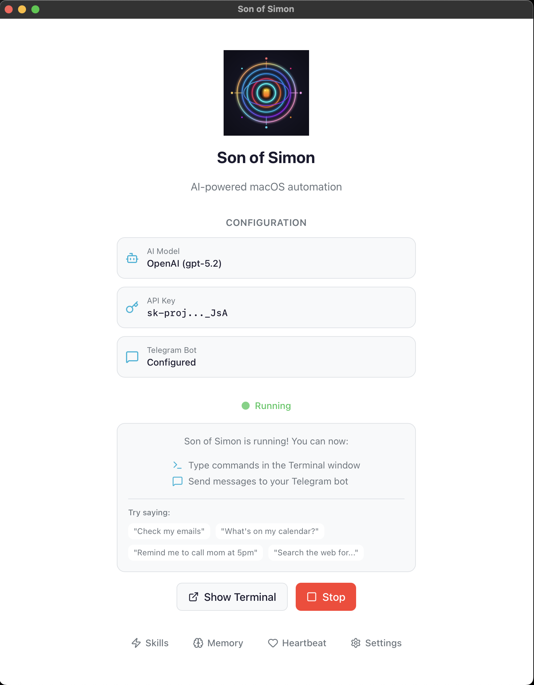
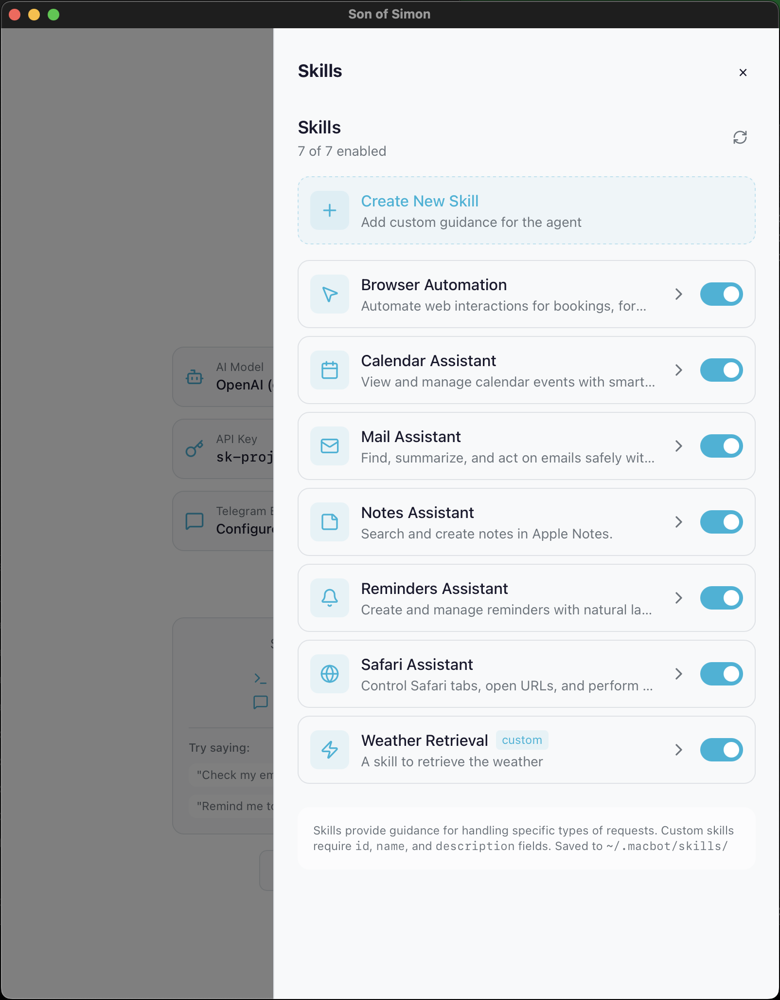
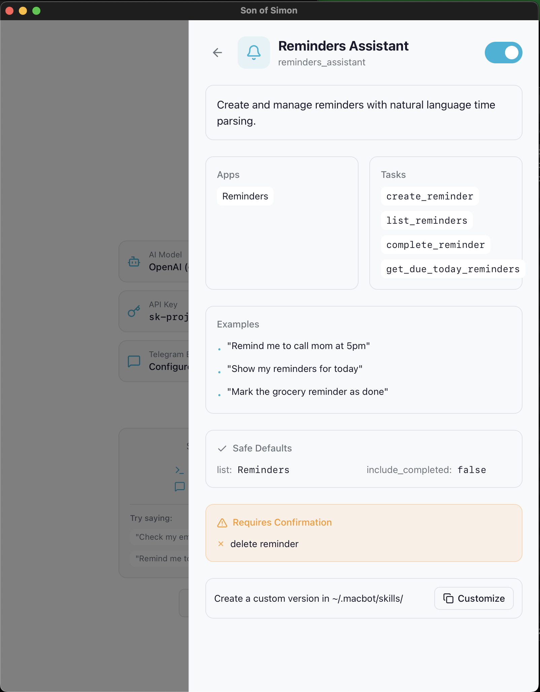
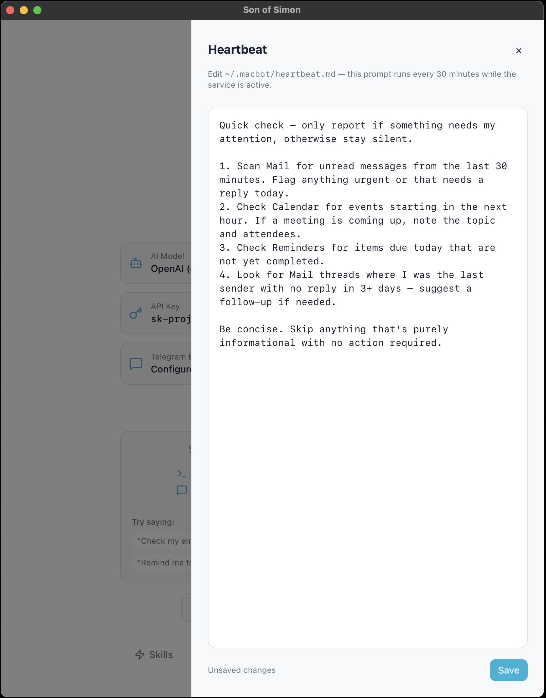

<p align="center">
  
</p>

<h1 align="center">Son of Simon</h1>

<p align="center">
  <em>Your personal Mac assistant. Built-in apps. Voice messages. Secure by default. No setup headaches.</em>
</p>

---

## What is this?

Son of Simon is an AI assistant for macOS that works directly with your built-in Apple apps — Mail, Calendar, Reminders, Notes, and Safari. Think of it as the macOS automation layer that OpenClaw is missing.

Where tools like OpenClaw need browser scraping or OAuth flows to access Gmail or Office 365, Son of Simon uses Apple's native app integration. Just add your account in Apple Mail or Calendar and the agent can use it. No tokens, no OAuth, no browser automation needed.

Son of Simon is also more secure in practice because it does not run a separate gateway service. There is no always-on gateway process to expose or configure, which reduces the attack surface compared to a gateway-based setup like OpenClaw.

Skills are compatible with the [AgentSkills standard](https://agentskills.io) used by OpenClaw, Claude Code, and Cursor — so community skills work across tools.

You do not need to code. Download the app, sign in, and start asking.

## What it can do

- Summarize your inbox and find important emails
- Create calendar events and reminders
- Search your notes
- Open and control Safari tabs
- Fill out simple web forms (bookings, purchases, etc.)
- Send and receive messages over Telegram (text or voice)
- Run daily or weekly routines (optional)
- Heartbeat — a prompt that runs every 30 minutes while the service is active

## How it works (simple version)

- It uses your built-in Apple apps instead of screen scraping
- It uses the browser only when it has to
- It can listen to your Telegram voice messages if you want remote control

## Get started (most people)

1. Download the latest `.dmg` from Releases
2. Drag Son of Simon to your Applications folder
3. Open it and follow the setup steps

The setup wizard will guide you through:
- Connecting your AI provider (Anthropic, OpenAI, or OpenRouter)
- Choosing a model (Claude, GPT-5, DeepSeek, Gemini, GLM, Llama, and more)
- Granting macOS permissions
- Optional Telegram setup

<p align="center">
  
</p>

## Skills (AgentSkills compatible)

Skills provide guidance for handling specific types of requests. Son of Simon comes with built-in skills for Mail, Calendar, Reminders, Notes, Safari, and Browser Automation. You can enable or disable skills, customize built-in ones, or create your own.

<p align="center">
  
</p>

Each skill defines:
- Which apps and tasks it uses
- Example prompts that trigger it
- Safe defaults to prevent mistakes
- Actions that require your confirmation

<p align="center">
  
</p>

Custom skills are saved to `~/.macbot/skills/`. Skills use the **AgentSkills standard** (the same SKILL.md format used by OpenClaw, Claude Code, and Cursor) so you can drop in skills from any compatible tool and they just work.

### Install skills from ClawHub

[ClawHub](https://clawhub.ai) is a community registry of agent skills. You can browse and install skills directly by asking the agent:

> "Search ClawHub for a Slack skill"
> "Install https://clawhub.ai/steipete/slack"

The agent will install the skill and automatically enrich it with task mappings and behavior notes so it works out of the box. You can also use the CLI:

```bash
npm install -g clawhub                              # one-time setup
clawhub search slack                                 # find skills
clawhub install --dir ~/.macbot/skills slack          # install
son skills enrich slack                              # enrich with AI
```

## AI providers and models

Son of Simon works with multiple AI providers. Pick one during setup or change it later in `~/.macbot/.env`.

| Provider | Models | Key prefix |
|---|---|---|
| **Anthropic** | Claude Sonnet 4.5, Opus 4.6, Haiku 4.5 | `sk-ant-` |
| **OpenAI** | GPT-5.2, GPT-5.2 Pro, GPT-5.1, GPT-5 Mini, o4-mini | `sk-proj-` |
| **OpenRouter** | DeepSeek V3.2, Gemini 2.5 Flash/Pro, GLM 4.7, Llama 4 Maverick, Qwen 3, Grok 4.1 | `sk-or-` |

OpenRouter gives you access to dozens of models with a single API key. Good if you want to experiment.

## Memory and Heartbeat

**Memory** — Edit `~/.macbot/memory.yaml` from the dashboard (Brain icon) or any text editor. This file is loaded into every agent interaction as persistent context. Use it to store preferences, facts, or instructions the agent should always know.

**Heartbeat** — Edit `~/.macbot/heartbeat.md` from the dashboard (Heart icon). When `son start` is running, this prompt executes every 30 minutes during active hours (7 AM - 11 PM). If the file is empty or missing, nothing happens. Results are sent to Telegram if configured.

Use it for recurring checks like:
- Scan Mail for unread messages and flag anything urgent
- Check Calendar for upcoming meetings
- Check Reminders for items due today
- Suggest follow-ups on unanswered email threads

<p align="center">
  
</p>

## Requirements

- macOS
- Apple apps configured (Mail, Calendar, Reminders)
- Internet access for your AI provider
- Optional: Telegram bot for remote access

## Secure by default

Son of Simon does not store your passwords. Your email, calendar, and other account credentials are managed by macOS Keychain — the same way Apple Mail and Calendar already handle them. The assistant talks to your apps through AppleScript. It never sees or stores your passwords.

There is no gateway process, no server to expose, and no OAuth tokens to manage. Nothing listens on a port. The attack surface is your Mac and the LLM API call — that's it.

- No stored passwords — macOS Keychain handles authentication
- No gateway — nothing listening on a port, no service to configure or secure
- No OAuth tokens — the apps are already signed in, the agent just uses them
- No browser automation for your own data — AppleScript talks to apps directly
- LLM API calls are the only traffic that leaves your Mac

## It learns you

Son of Simon remembers context between conversations. It stores observations about your preferences, habits, and patterns into a local memory file. Over time it gets better at helping you — it will know how you like your emails drafted, which calendar you use for work vs personal, and how you prefer reminders worded.

All memory is stored locally in `~/.macbot/memory/`. Nothing is shared. You can read, edit, or delete it at any time.

## OpenClaw vs Son of Simon

|  | Son of Simon | OpenClaw |
|---|---|---|
| **Platform** | macOS only | Cross-platform |
| **Apple apps** | Native (Mail, Calendar, Reminders, Notes, Safari) | Limited (iMessage via imsg) |
| **Gmail / Office 365** | Just add account in Apple Mail/Calendar | Browser flow or OAuth setup |
| **Setup** | Single app with guided wizard | Gateway + configuration |
| **Passwords** | Handled by macOS Keychain — never stored | OAuth tokens / API keys you manage |
| **Gateway** | None — no ports open, no service to expose | Always-on gateway process |
| **Memory** | Learns your preferences over time, stored locally | Persistent memory (cloud or local) |
| **Skills format** | AgentSkills standard (compatible) | AgentSkills standard (compatible) |
| **Messaging** | Telegram | WhatsApp, Telegram, Slack, Discord, Signal, iMessage, etc. |

**Use Son of Simon if** you want deep macOS automation that works with your built-in Apple apps out of the box, no OAuth or browser scraping needed. Skills are cross-compatible — you can use OpenClaw community skills in Son of Simon and vice versa.

**Use OpenClaw if** you want a cross-platform hub with many messaging channels and don't mind extra setup.

## Optional extras

- Paperless-ngx integration for documents
- Time tracking
- Scheduled jobs (daily or hourly tasks)

## Advanced (run from source)

If you want to run Son of Simon from this repository:

```bash
pip install -e .
son onboard
son run "Check my emails and summarize urgent ones"
```

Common commands:

| Command | Description |
|---------|-------------|
| `son run "<goal>"` | Run a natural language goal |
| `son chat` | Interactive chat mode |
| `son start` | Start background service (heartbeat + Telegram + cron) |
| `son doctor` | Verify setup and permissions |

## License

MIT License
