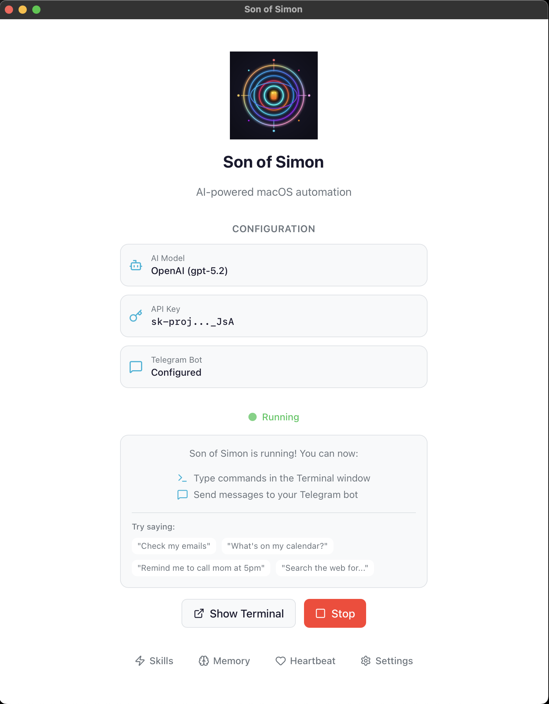

<p align="center">
  
</p>

<h1 align="center">Son of Simon</h1>

<p align="center">
  <em>Your personal Mac assistant. Built-in apps. Voice messages. Secure by default. No setup headaches.</em>
</p>

## Why

Your Mac is already set up. Why should an AI make you do it again with OAuth and gateways?

## What is this?

Son of Simon is an AI assistant for macOS that works directly with your Apple apps — Mail, Calendar, Reminders, Notes, Safari, Contacts, Messages, and Things3. It runs with cloud providers (Anthropic, OpenAI, Google Gemini, OpenRouter) or **fully offline on your Mac** using [Pico AI Server](https://apps.apple.com/app/pico-ai-server/id6502491545) — no API key needed for local models. Add your account in Apple Mail/Calendar and the agent can use it. You do not need to code. Download the app, sign in, and start asking.

|  | Son of Simon | Claude / ChatGPT | OpenClaw |
|---|---|---|---|
| **Control Apple apps** | Yes — Mail, Calendar, Reminders, Notes, Safari, Contacts, Messages, Things3 | No | Limited |
| **Local models** | Yes — via Pico AI Server, no API key needed | No | No |
| **Setup** | One app, guided wizard | Browser sign-in | Complex, error-prone |
| **Passwords / tokens** | Never accessed — apps are already signed in | Not needed | Stores OAuth tokens |
| **Skills ecosystem** | [AgentSkills](https://agentskills.io) / [ClawHub](https://clawhub.ai) | Plugins / GPTs | AgentSkills |

For a detailed comparison with OpenClaw, see [docs/COMPARISON.md](docs/COMPARISON.md).

## What it can do

<p align="center">
  
</p>

### Apps

| App | Capabilities |
|---|---|
| **Mail** | Search, read, mark read, move to trash — directly over IMAP / Microsoft Graph, no Mail.app required (all accounts). See [Mail accounts](#mail-accounts) |
| **Calendar** | Create events, check your schedule, find conflicts |
| **Reminders** | Set reminders, mark done, organize lists |
| **Notes** | Create, search, organize into folders, move, delete |
| **Safari** | Open URLs, read pages, click buttons, fill forms, take screenshots, run JS |
| **Contacts** | Search, retrieve, and create contacts — email, phone, organization lookups |
| **Things3** | Create, complete, move, and search to-dos; manage projects and tags |

### Messaging

| App | Capabilities |
|---|---|
| **Messages** | Send iMessages/SMS and search message history |
| **Telegram** | Send & receive text, voice, or photo messages — use as remote control for the agent |
| **WhatsApp** | Read chats, search messages, send replies (via `whatsapp-cli`) |
| **Microsoft Teams** | List teams/channels, read & send channel and chat messages (multi-account) |

### Files & Data

| Tool | Capabilities |
|---|---|
| **Spotlight** | Find files by name, content, type, or recently opened |
| **Files** | Read, write, and search files on disk — including PDF reading |
| **PDFs** | Create PDF documents from text or HTML with tables, headings, and formatting |
| **Downloads** | Auto-organize your Downloads folder into categorized subfolders |
| **Data Apps** | Create interactive HTML dashboards from CSV, JSON, bank statements, or APIs |

### System

| Control | Capabilities |
|---|---|
| **System Controls** | Toggle WiFi, Bluetooth, dark mode, Do Not Disturb; adjust volume; check status |

### Web & Services

| Service | Capabilities |
|---|---|
| **Web** | Google search, fetch URLs, read Hacker News |
| **Paperless-ngx** | Search, upload, download, and tag documents |

### Chained actions

Because it chains tools automatically, you can ask things like:
- *"My mom sent me her vacation dates by email — add them to my calendar"*
- *"Summarize my unread emails and send me a Telegram message with the highlights"*
- *"Find the PDF invoice from last week and upload it to Paperless"*
- *"Organize my Downloads folder and sort everything by type"*
- *"Find the bank statement CSV in my Downloads and create a spending dashboard from it"*

## Get started

1. Download the latest `.dmg` from Releases
2. Drag Son of Simon to your Applications folder
3. Open it and follow the setup steps

The setup wizard will guide you through:
- Connecting your AI provider (Anthropic, OpenAI, Google Gemini, OpenRouter, or Pico for local models)
- Choosing a model (Claude, GPT-5, DeepSeek, Gemini, Llama, or any model running locally)
- Granting macOS permissions
- Optional Telegram setup

First success (safe demo prompts):
- "What's on my calendar today? (Read-only.)"
- "Summarize my unread emails and highlight anything urgent. Don't reply or send anything."
- "Search my Notes for anything about &lt;keyword&gt; and summarize what you find."

<p align="center">
  
</p>

## Mail accounts

Mail talks to your accounts directly — IMAP, or Microsoft Graph for Exchange tenants that have turned IMAP off. This is the default and the preferred path, and it works with **Mail.app closed**.

The reason is plain: driving Mail.app over AppleScript is unreliable. Every lookup is an Apple Event that costs a tenth of a second or more, large mailboxes time out, results come back inconsistent, and the whole thing only works while Mail.app is running. Going straight to the account over its own protocol is faster, predictable, and doesn't depend on a GUI app being open.

Set up each account once:

```bash
son mail login you@example.com   # one-time, interactive
son mail accounts                # shows every account and whether it works
```

- **Microsoft / Exchange** — OAuth via device code (no password stored). Uses IMAP where the tenant allows it, and falls back to Microsoft Graph where the tenant has disabled IMAP. Needs an Azure app id in `MACBOT_MS_OAUTH_CLIENT_ID`.
- **Gmail / iCloud** — an app password (2‑Step Verification required), stored in the macOS Keychain, never on disk. `son mail login` walks you through generating one.

`son mail accounts` live-probes each mailbox and shows a Working column, so you can see at a glance which accounts are ready and which still need a login.

The old AppleScript-via-Mail.app email tasks still exist but are **off by default**. Turn them back on only if you specifically need something the direct path doesn't cover yet (e.g. sending with attachments) by setting `MACBOT_ENABLE_MAILAPP_TASKS=true`.

## Skills

Son of Simon comes with built-in skills for Mail, Calendar, Reminders, Notes, Safari, Contacts, Messages, Things3, System Controls, Scheduled Tasks, Browser Automation, Downloads Organizer, Image Generation, and Data App Creator. Skills use the [AgentSkills standard](https://agentskills.io) — community skills from [ClawHub](https://clawhub.ai) work out of the box. See [docs/SKILLS.md](docs/SKILLS.md) for custom skills, CLI commands, and ClawHub install instructions.

## AI providers

Works with cloud providers — Anthropic, OpenAI, Google Gemini, and OpenRouter — or run models locally on your Mac with [Pico AI Server](https://apps.apple.com/app/pico-ai-server/id6502491545). No API key needed for local models. Gemini models support native image generation. Pick a provider during setup or switch any time. See [docs/AI_PROVIDERS.md](docs/AI_PROVIDERS.md) for the full model table.

## Memory and Heartbeat

Son of Simon remembers context between conversations — preferences, habits, and patterns — in a local memory file (`~/.macbot/memory.yaml`). You can read, edit, or delete it at any time. The heartbeat (`~/.macbot/heartbeat.md`) runs a prompt periodically while the service is active, useful for recurring checks like scanning for urgent emails or upcoming meetings. All data stays on your Mac under `~/.macbot/`.

## Requirements

- macOS
- Apple apps configured (Mail, Calendar, Reminders)
- An AI provider: cloud API key **or** [Pico AI Server](https://apps.apple.com/app/pico-ai-server/id6502491545) for fully offline local inference
- Optional: Telegram bot for remote access

## Secure by default

Credentials stay in the macOS Keychain — provider API keys, plus OAuth tokens and app passwords for mail — never in plaintext. Mail goes straight to your accounts over IMAP/Graph; Calendar, Reminders, Notes and the other Apple apps are driven locally on your Mac. Your prompts go to your chosen LLM provider; nothing else leaves your Mac. See [docs/SECURITY.md](docs/SECURITY.md) for the full security model and privacy details.

## Scheduled tasks

Create recurring or one-shot scheduled tasks through natural language or the dashboard GUI. Uses cron expressions with timezone support. Useful for daily email summaries, meeting prep, or periodic reminders.

## Optional extras

- **Microsoft Teams** — Ask the agent to "set up Teams". The [Azure CLI](https://learn.microsoft.com/en-us/cli/azure/) (`brew install azure-cli`) handles the Azure AD app registration so you never need to navigate the Azure Portal. Supports multiple accounts (e.g., work + personal tenant). See [Teams setup guide](docs/TEAMS_SETUP.md) for details.
- **Mindwtr GTD** — Full GTD task management via direct file sync (set `MACBOT_MINDWTR_DATA_PATH`)
- Paperless-ngx integration for documents
- Time tracking

## Learn more

- [Skills](docs/SKILLS.md) — custom skills, CLI commands, ClawHub
- [AI Providers](docs/AI_PROVIDERS.md) — supported models and configuration
- [Security & Privacy](docs/SECURITY.md) — security model, data egress, permissions
- [OpenClaw Comparison](docs/COMPARISON.md) — feature comparison with OpenClaw
- [Development](docs/DEVELOPMENT.md) — CLI usage, running from source, building
- [Teams Setup](docs/TEAMS_SETUP.md) — Microsoft Teams integration guide

## License

MIT License
